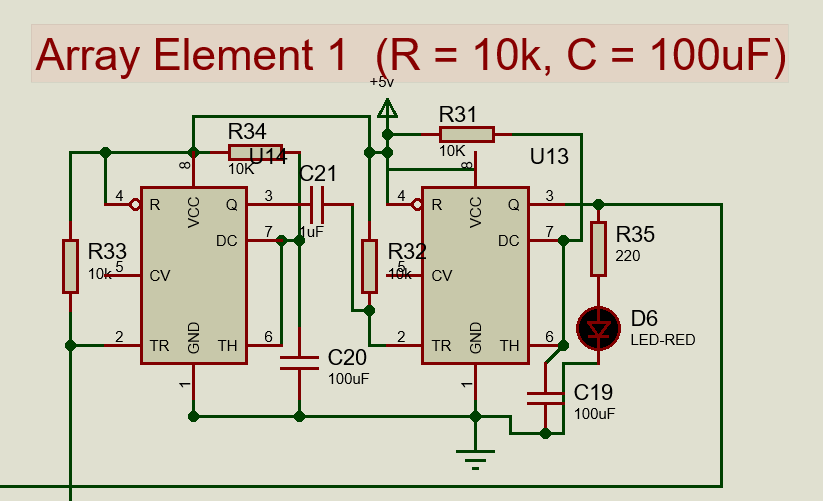
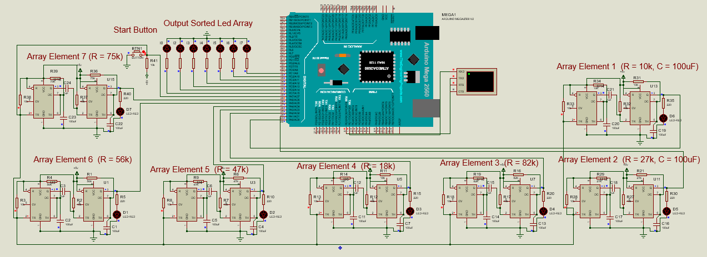
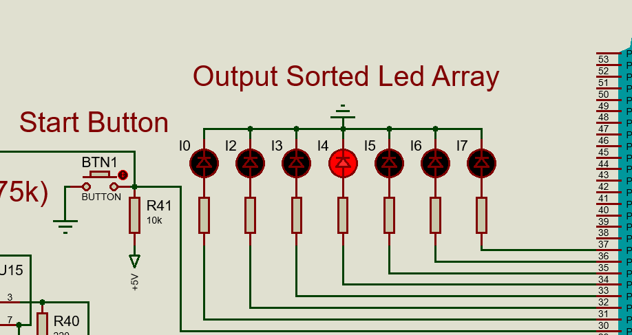

# Hardware-Based Analog Sorting with 555 Timers

This project is a hardware-driven sorting system developed as a solution to a pre-interview technical challenge from **Brahma Works**. It sorts an array of numbers without using any software sorting algorithms, instead offloading the entire sorting logic to analog electronic circuits.

### The Challenge
Given an array `x = [1, 3, 9, 2, 5, 6, 8]`, sort it without a classical sorter. Use a 555 timer circuit to light up LEDs for this array.

### Live Demonstration

A full video demonstration of the Proteus simulation can be viewed by clicking the thumbnail below.

[![Hardware Sorter Simulation Video]](https://drive.google.com/file/d/1HmgJuh8qzN1FeSFAcoYD7Knws6reGkTU/view?usp=sharing)

---

## What is This Project?

This is a hardware-software co-design project that physically demonstrates the concept of "sorting with time." Instead of comparing numbers with `if` statements in code, this system converts numbers into time delays. The smaller the number, the shorter the delay. An Arduino microcontroller then acts as a passive observer, determining the sorted order by simply watching which delay finishes first.

---

## How It Works: The Technical Breakdown

The core of the solution is to think of the numbers not as values to be compared, but as runners in a race. The number itself determines the runner's handicap; a smaller number means a shorter handicap (delay).

#### 1. The 555 Timer: An Analog Delay Unit

The heart of each "Array Element" is a **555 timer** configured in **monostable (or "one-shot") mode**. In this mode, when triggered, the timer outputs a single HIGH pulse for a specific duration. This duration (`T`) is determined by the formula: `T = 1.1 × R × C`.

By keeping the capacitor (`C`) fixed at **100µF**, we can control the time delay simply by changing the resistor (`R`). This allows us to convert any number into a specific time delay.

#### RC Value Table for Delay Generation
To achieve the desired time delays for our array values, we use a fixed 100µF capacitor and select resistors according to the following table:

| Target Delay | Resistor Value |
| :----------: | :------------: |
|    1 sec     |     10 kΩ      |
|    2 sec     |     18 kΩ      |
|    3 sec     |     27 kΩ      |
|    5 sec     |     47 kΩ      |
|    6 sec     |     56 kΩ      |
|    8 sec     |     75 kΩ      |
|    9 sec     |     82 kΩ      |

#### 2. The Full Circuit: A Seven-Way Race

We build seven of these timer circuits—one for each number in the array. A single "Start Button" is wired to the trigger pin of all seven timers. When the button is pressed, all timers are triggered simultaneously, and the "race" begins.

---

## The Sorting Process Explained

The "sorting" happens entirely in hardware as a race against time, with the Arduino acting as the finish-line judge.

**Input Array:** `[1, 3, 9, 2, 5, 6, 8]`

#### Step 1: Hardware Mapping
Each value in the array is assigned to a physical 555 timer circuit, which is connected to a specific Arduino pin. The resistor in each circuit is chosen to match the array value's desired delay.

| Array Value | Resistor Used | Connected to Arduino Pin |
| :---------: | :-----------: | :----------------------: |
|      1      |     10 kΩ     |            22            |
|      3      |     27 kΩ     |            23            |
|      9      |     82 kΩ     |            24            |
|      2      |     18 kΩ     |            25            |
|      5      |     47 kΩ     |            26            |
|      6      |     56 kΩ     |            27            |
|      8      |     75 kΩ     |            28            |

#### Step 2: The Trigger (T=0)
The "Start Button" is pressed. All 7 timers start their monostable cycle simultaneously. The Arduino code also starts its internal timer (`millis()`).

#### Step 3: Passive Observation (The "Race")
The Arduino's firmware does nothing but watch the input pins. It doesn't know the values; it only knows which pin changes state and when.

- At **~1 second**, the timer with the 10kΩ resistor finishes its cycle. Pin 22 goes HIGH.
  - **Arduino's Log:** `1st place: Pin 22`.
- At **~2 seconds**, the timer with the 18kΩ resistor finishes. Pin 25 goes HIGH.
  - **Arduino's Log:** `2nd place: Pin 25`.
- At **~3 seconds**, the timer with the 27kΩ resistor finishes. Pin 23 goes HIGH.
  - **Arduino's Log:** `3rd place: Pin 23`.
- ...and so on.

This continues until all pins have gone HIGH. The final observed order is stored in an array: `highSignalOrder = [22, 25, 23, 26, 27, 28, 24]`.

#### Step 4: The Final Display
The system now has a sorted list of *pins*. The firmware uses this list to control the output LEDs. The first LED blinks, then the second, then the third, and so on, creating a visual representation of the sorted sequence. The **duration** of each blink is determined by the pulse width measured for its timer, representing the original value.

---

### How to Simulate the Project

1.  **Open the Simulation:** Open the `Array_555_leds.pdsprj` file in Proteus.
2.  **Compile the Firmware:** Build the project using PlatformIO (`platformio run`). This will generate a `.hex` file inside the `.pio/build/megaatmega2560/` directory.
3.  **Load Firmware into Arduino:** Double-click the Arduino Mega component in the Proteus schematic and load the generated `firmware.hex` file into it.
4.  **Run Simulation:** Start the simulation. Press the "Start Button" to trigger the timers.
5.  **Observe:** Watch the serial monitor output in Proteus to see the detection logs and the final sorted order. The LEDs on the schematic will begin to blink according to the sorted sequence.

### Pinout (Arduino Mega)
| Purpose             | Pin Numbers     |
| ------------------- | --------------- |
| Timer Signal Inputs | 22 – 28         |
| LED Outputs         | 30 – 36         |
| Start Pushbutton    | 29              |
